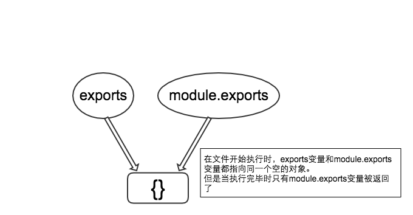

## 不要把es6的export和commonjs的exports搞混淆

同样都是作为模块化导出的方案，这两者看似相似，其实却有着本质的不同，笼统的说，exports后面多一个s，我们可以将其理解成export的升级版(plus)，这样一个升级版自然是要给后台用的，也就是nodejs来用的，把这个搞清楚后，我们现在就只来讨论nodejs后台部分使用的exports和module.exports的区别。

module.exports和exports的关系我们可以用这张图来解释
