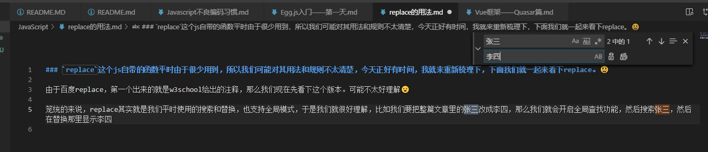
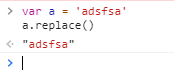
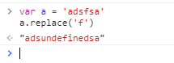
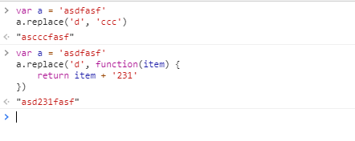
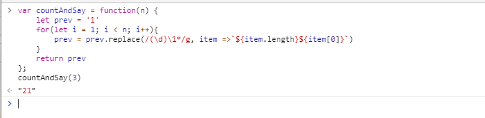

### `replace`这个js自带的函数平时由于很少用到，所以我们可能对其用法和规则不太清楚，今天正好有时间，我就来重新梳理下，下面我们就一起来看下replace。😃
---
由于百度replace，第一个出来的就是w3school给出的注释，那么我们现在先看下这个版本。可能不太好理解😦

笼统的来说，replace其实就是我们平时使用的搜索和替换，也支持全局模式，于是我们就很好理解，比如我们要把整篇文章里的张三改成李四，那么我们就会开启全局查找功能，然后搜索张三，然后在替换那里显示李四。

replace作为一个函数，使用他的时候自然是可以传递参数的，大体来说，参数有两个，第一个可以是固定的字符串，也可以是模糊的正则表达式，第一个参数没别的用途，就是用来匹配的，就好比是按图索骥，第一个参数就是我们交给replace的一张参考图，有了整个replace才能帮我们工作，否则没有目标，replace也是会生气的

看到了吗，如果什么参数都没有，replace会原样返回原始字符串。

111221
同样的，如果我们只是让replace去查找，由于我们没有告诉他找到了要干什么，那么这样就会导致replace会将找到的对应字符替换成undefined，也就是未定义。
所以，第二个参数的作用不言而喻，就是告诉replace函数，找到了目标后，应该替换成什么。

其实如果只是单纯的字符串替换，那么第二个参数也传个字符串，然后就可以实现替换的功能了，但是问题就出现在这第二个参数，这第二个参数除了可以是普通的字符串，还可以是一个函数。

看到这里你可能觉得无聊，觉得replace不过如此，但是大招一般都是放到最后才放的。

看到这个呢，是不是整个人都不好了呢？

其实我们可以先抛开for循环，只看里面的内容的话，在第一次for循环执行时，由于`prev`的值是'1'，而他用的正是函数的方式来替换的，替换的规则就是把任意单个数字后面跟多个或者不跟一个1的一个整体，替换成当前整个整体的长度加上这个数拼接起来的值，比如1，替换完就成了11，11替换完就成了21...

这个逻辑换算成程序的话就是把相同的挨着的几个字符批量念出来，类似英文手机号的念法，知道下午才突然发现，这道题的难点其实不在replace，而是
```javascript
/(\d)\1*/g <<===>> /1+|2+|3+|4+|5+|6+|7+|8+|9+|0+/g
```
这两者其实是等价的。😓，我思来想去才搞明白这点。