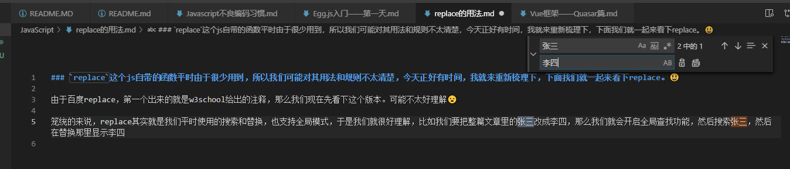
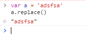
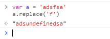

### `replace`这个js自带的函数平时由于很少用到，所以我们可能对其用法和规则不太清楚，今天正好有时间，我就来重新梳理下，下面我们就一起来看下replace。😃
---
由于百度replace，第一个出来的就是w3school给出的注释，那么我们现在先看下这个版本。可能不太好理解😦

笼统的来说，replace其实就是我们平时使用的搜索和替换，也支持全局模式，于是我们就很好理解，比如我们要把整篇文章里的张三改成李四，那么我们就会开启全局查找功能，然后搜索张三，然后在替换那里显示李四。

replace作为一个函数，使用他的时候自然是可以传递参数的，大体来说，参数有两个，第一个可以是固定的字符串，也可以是模糊的正则表达式，第一个参数没别的用途，就是用来匹配的，就好比是按图索骥，第一个参数就是我们交给replace的一张参考图，有了整个replace才能帮我们工作，否则没有目标，replace也是会生气的

看到了吗，如果什么参数都没有，replace会原样返回原始字符串。

